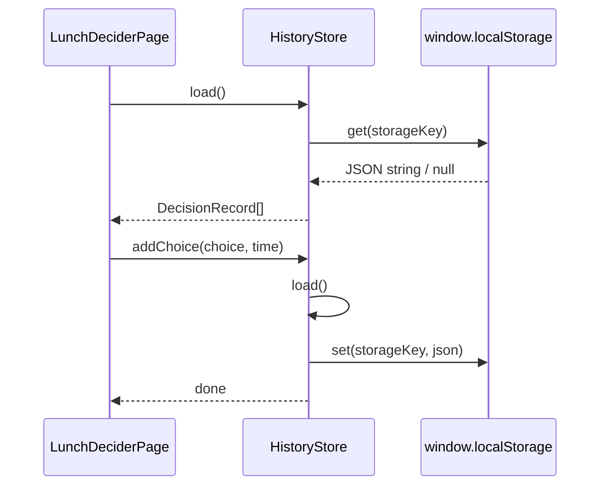

# `lib/core/history_store.dart` 索引

## 作用

- 使用 Web `localStorage` 存储历史记录（JSON）
- 提供 `load / save / addChoice / clear`
- 打印日志，方便录屏时展示“数据层调用”

## 存储结构

- key：`kunlun_lunch_history_v1`
- value：`List<Map>` JSON
  - `choice: String`
  - `timestampMs: int`

## 交互图（Mermaid）

