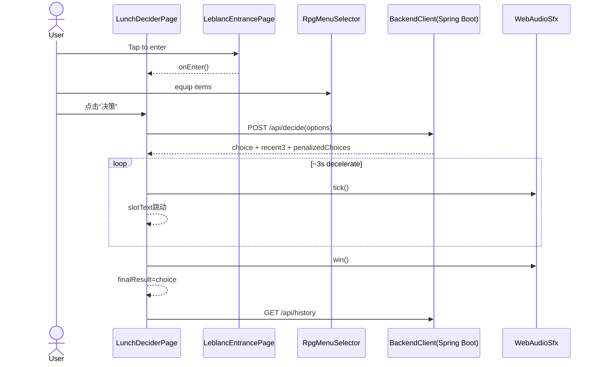

# `lib/main.dart` 索引

## 作用

- App 入口：`KunLunLunchApp`（P5R/Leblanc 风格主题）
- 主流程：`LunchDeciderPage`
  - 入口页：`LeblancEntrancePage`（点按进入）
  - RPG 点菜：`RpgMenuSelector`（分类/列表/描述）+ “快速添加”
  - 决策仪式：3 秒老虎机滚动，停在后端返回结果
  - 展示：`ResultReveal`（放大+震动）+ `RecentHistory`（最近 5 天）

## 核心状态（`_LunchDeciderPageState`）

- `_currentPage`：`entrance/menu` 两态切换
- `_selectedOptions`：当前“已装备”的菜单集合（会作为 `/api/decide` options）
- `_spinning/_slotText/_finalResult`：仪式滚动与最终展示
- `_historyRecords/_recent3`：历史与最近 3 次（来自后端）
- `_quickAddController`：快速添加输入框

## 关键流程（Mermaid）

